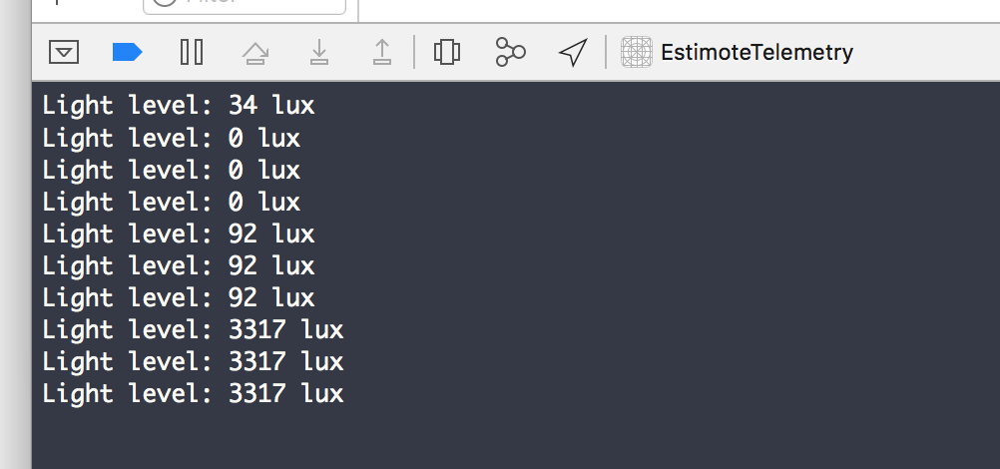

# telemetry

## What's this

This demo project shows how to read sensors data from Estimote beacons.

## Requirements

Basic iOS development environment

- Xcode 8
- CocoaPods 1.2.0
- iPhone
- Estimote beacon

## How to get up and running

Clone the project.

```
git clone https://github.com/CoolestProjects/appathon-ios.git
```

Install EstimoteSDK via CocoaPods.

```
cd appathon-ios/telemetry
pod install
```

Open the project with Xcode. Be sure to open the workspace file.

```
open EstimoteTelemetry.xcworkspace
```

Run the app and watch the ambient light changes notifications appear in the console



## Links

- [Estimote Telemetry tutorial](http://developer.estimote.com/sensors/estimote-telemetry/)
